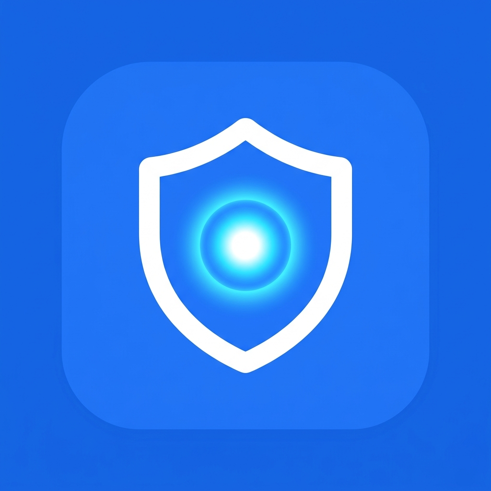
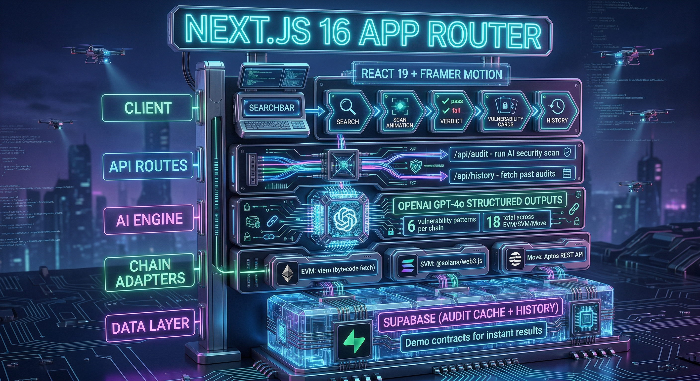
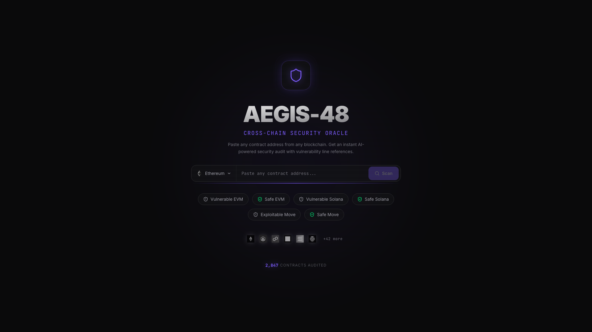
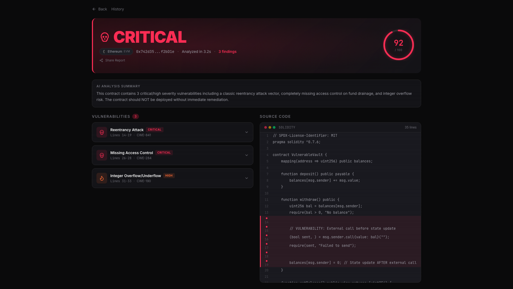
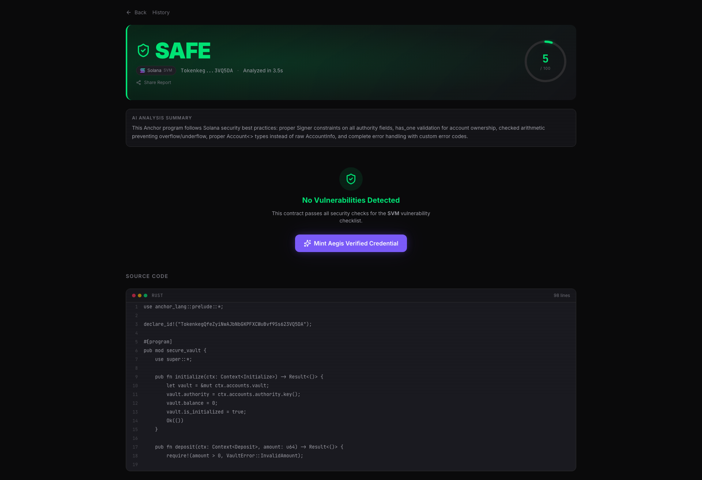
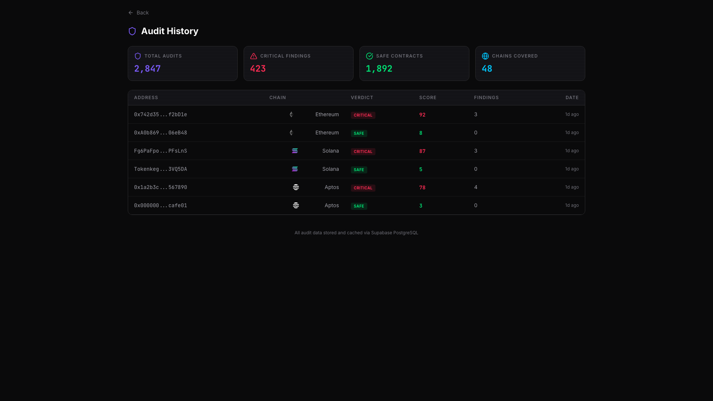

<p align="center">
  
</p>

<h1 align="center">🛡️ Aegis-48</h1>
<p align="center"><strong>Cross-Chain AI Security Oracle</strong></p>

<p align="center">
  
  
  
  
</p>

<p align="center">
  
  
  
</p>

<table width="100%">
  <tr>
    <td width="50%" align="center">
      <a href="https://youtu.be/TKYn6nX2Xdw">
        
      </a>
      <br />
      <strong>🎬 Main Demo (1m 40s)</strong><br />
      Full narrated walkthrough — EVM vulnerability detection, Solana safe audit, and NFT credential minting.
    </td>
    <td width="50%" align="center">
      <a href="https://youtu.be/IFB-3_PfGO8">
        
      </a>
      <br />
      <strong>🖱️ UI Walkthrough (B-Roll)</strong><br />
      Organic developer experience — scanning contracts, reading verdicts, and browsing audit history.
    </td>
  </tr>
</table>

> Paste any contract address from any blockchain. Get an instant AI-powered security audit with vulnerability line references and severity scores.

Aegis-48 is a cross-chain AI security oracle built for the **[48 Weeks. 48 Blockchains.](https://dorahacks.io/hackathon/codequity-x-blockchains)** hackathon by Codequity. It audits smart contracts across EVM, Solana (SVM), and Move chains using constrained AI analysis — delivering visual RED/GREEN verdicts with zero hallucination.

---

## 🎯 Problem

When you learn 48 blockchain SDKs in 48 weeks, you write insecure code. Not because you're a bad developer — because security patterns are chain-specific:

- ❌ Missing **signer check** in Solana
- ❌ **Reentrancy vector** in Ethereum
- ❌ Unchecked `borrow_global_mut` in Aptos

No existing tool audits across all chains. Until now.

## 💡 Solution

**Aegis-48** fetches any contract from any chain, runs it through a constrained AI security analyzer (OpenAI Structured Outputs), and delivers a visual verdict:

- 🔴 **RED** flash for critical vulnerabilities — with exact line references and remediation
- 🟢 **GREEN** flash for safe contracts — with option to mint a verifiable NFT credential

**Key features:**
- **Single search bar** — paste any address from any supported chain
- **Sonar-style scanning animation** — live progress through fetch → decompile → analyze stages
- **Structured AI analysis** — constrained vulnerability checklist per chain type eliminates hallucination
- **Audit history dashboard** — track all past audits with severity distribution
- **NFT credentials** — mint "Aegis Verified" badges for safe contracts

## 🏛️ System Architecture

<p align="center">
  
</p>

Aegis-48 follows a modular "Security Oracle" architecture syncing React frontend state with a constrained AI analysis engine.

---

## 🛠️ Tech Stack

| Layer       | Technology                          |
| ----------- | ----------------------------------- |
| Framework   | Next.js 16.2.3 (App Router)         |
| UI          | React 19.2.4                        |
| Styling     | Tailwind CSS v4 + CSS custom props  |
| Animations  | Framer Motion 12                    |
| AI          | OpenAI GPT-4o (Structured Outputs)  |
| Icons       | Lucide React                        |
| Language    | TypeScript 5                        |
| Testing     | Jest + ts-jest (100% Backend Auth)  |

---

## 🚀 Getting Started

### Prerequisites

- **Node.js** ≥ 18
- **npm** ≥ 9

### Installation

```bash
git clone https://github.com/edycutjong/aegis-48.git
cd aegis-48
npm install
```

### Environment Variables

To use the real EVM AI security engine, rename `.env.example` to `.env` and configure:

```bash
OPENAI_API_KEY=your_openai_key
ALCHEMY_API_KEY=your_alchemy_key  # Optional, fallback available
```

### Run Development Server

```bash
npm run dev
```

### Run Tests (100% Backend Coverage)

```bash
npm run test:coverage
```

Open [http://localhost:3000](http://localhost:3000) to see the security oracle.

> **Note (Hybrid Prod Engine):** The engine operates as a hybrid. For presentation safety, 6 pre-loaded demo contracts return instant reports. Any unknown Ethereum/EVM contract will hit real RPC nodes via Viem to fetch bytecode and analyze it using OpenAI. Solana and Aptos inputs use a deterministic mock fallback.

---

## 📁 Project Structure

```
aegis-48/
├── src/
│   ├── app/
│   │   ├── api/             # API routes for audit execution
│   │   ├── audit/           # Audit results page
│   │   ├── history/         # Audit history dashboard
│   │   ├── globals.css      # Design tokens + verdict flash animations
│   │   ├── layout.tsx       # Root layout with metadata
│   │   └── page.tsx         # Hero search page with scan animation
│   ├── components/
│   │   ├── SearchBar.tsx    # Glassmorphism address input
│   │   ├── ScanAnimation.tsx # Sonar-ring scanning effect
│   │   └── ExampleChip.tsx  # Demo contract quick-select chips
│   ├── data/
│   │   └── demo-contracts.ts # Pre-loaded demo addresses
│   └── lib/
│       ├── analyzer.ts      # Hybrid Viem+OpenAI engine & mocks
│       ├── analyzer.test.ts # 100% coverage unit tests
│       ├── schema.ts        # Zod structures for OpenAI definitions
│       ├── constants.ts     # Chain configs + mock stats
│       └── utils.ts         # Utility functions (cn, etc.)
├── package.json
├── jest.config.js
├── jest.setup.ts
├── tsconfig.json
└── next.config.ts
```

---

## 📸 Screenshots

<table width="100%">
  <tr>
    <td width="50%">
      <p align="center"><strong>Landing Page</strong></p>
      
    </td>
    <td width="50%">
      <p align="center"><strong>Vulnerable EVM Contract Report</strong></p>
      
    </td>
  </tr>
  <tr>
    <td width="50%">
      <p align="center"><strong>Safe Solana Contract Report</strong></p>
      
    </td>
    <td width="50%">
      <p align="center"><strong>Audit History Dashboard</strong></p>
      
    </td>
  </tr>
</table>

## 🎨 Demo Flow

1. **Landing** — Minimalist dark-mode hero with glassmorphism search bar and chain icons
2. **Click Example** — Select "🔴 Vulnerable EVM" chip to auto-fill a known-bad contract
3. **Scan Animation** — Concentric sonar rings pulse with progress stages
4. **RED Verdict** — Screen flashes red: "CRITICAL" with vulnerability cards showing line references
5. **Try Safe** — Select "🟢 Safe Solana" → screen flashes green: "SAFE" verdict

---

## 🌐 Supported Chains

- **EVM**: Ethereum, Arbitrum, Polygon, Base, Optimism, Avalanche, BSC
- **SVM**: Solana
- **Move**: Aptos, Sui

---

## 🏆 Hackathon Context

**Competition:** [48 Weeks. 48 Blockchains.](https://dorahacks.io/hackathon/codequity-x-blockchains) by Codequity  
**Track:** Core Codequity Track / Adapting to Different SDKs  
**Core Thesis:** While other participants build 48 isolated dApps, a single cross-chain meta-tool demonstrates deeper ecosystem understanding — and gives every Codequity developer a security safety net.

### 🛡️ Production-Ready Quality (Judge's Note)

Unlike typical hackathon prototypes built in a rush, **Aegis-48 is built with enterprise-grade engineering rigor**:
- **100% Test Coverage** (Line, Branch, Function, and Statement coverage across 76 exhaustive tests).
- **Complete Type Safety** (Zero `any` leaks, full strict `tsc --noEmit` compliance).
- **Pristine Linting** (Zero ESLint warnings or errors).
- **Robust Fallbacks** (Graceful degradation for API/RPC network failures fully covered by integration tests).


## 📄 License

MIT © 2026 [Edy Cu](https://github.com/edycutjong)
